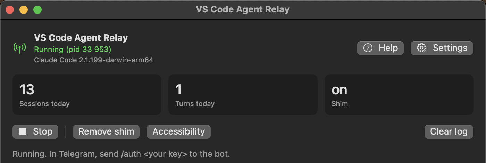

# VS Code Agent Relay

<p align="center">
  
  
  
  
  
  
  
  
</p>

Control long-running Claude Code sessions in VS Code from Telegram.

VSC Relay is for developers who leave Claude Code running in VS Code and do not want work
to stop because a session asked a question, requested permission, or waited for a single
follow-up prompt. It watches your local VS Code agent sessions and gives you a Telegram
control panel for reading status, replying, approving or denying prompts, and sending the
next instruction.

It is not a cloud service. It runs on your Mac, talks to Telegram by outbound HTTPS, and
uses local files and Unix sockets to observe and control local agent sessions.



## Why This Exists

Claude Code is useful for long tasks, but it often needs a human at exactly the wrong time:

- a multiple-choice question appears after you leave the desk;
- a tool or skill permission waits for approval;
- a risky shell command needs a yes or no;
- the task finishes and needs the next instruction;
- several VS Code windows are running and you need to know which one is blocked.

VSC Relay turns that into a Telegram workflow. Start the task on your Mac, leave it
running, and handle the next decision from your phone.

## What You Get

- A Telegram menu showing open VS Code windows and active Claude Code or Codex chats.
- Notifications when a session finishes, asks a question, errors, or needs attention.
- Background replies into Claude Code chats when the shim is installed.
- Telegram buttons for Claude Code questions, including multi-question prompts.
- Allow or Deny controls for permission requests surfaced through the relay.
- A blocked-command guard for dangerous shell commands such as `rm -rf`, `drop table`,
  `git push --force`, and patterns you add yourself.
- Claude Code controls for model, reasoning effort, and permission mode.
- Window focus and GUI fallback controls for cases where background control is unavailable.
- A small macOS app with token setup, pairing key setup, live log, service controls, and
  shim install or removal.

## How The Pieces Fit

```text
Claude Code in VS Code
        |
        | transcript files, hooks, optional shim
        v
vsc-relay-agent on your Mac
        |
        | Telegram Bot API, outbound HTTPS
        v
Telegram chat on your phone
```

The project is made of three local parts:

- `vsc-relay-agent` discovers sessions, watches transcripts, runs the Telegram bot, handles
  local hook events, and executes control actions.
- `vsc-claude-shim` optionally wraps the Claude Code helper binary so the relay can send
  text and question answers in the background.
- `VSCRelay.app` is the macOS UI for setup, starting and stopping the relay, viewing logs,
  and managing the shim.

Reading session state does not use screen scraping. The relay reads the files Claude Code,
Codex, and VS Code already write locally. macOS Accessibility is only needed for window
focus and GUI fallback actions.

## Support Matrix

| Target | Read status | Send prompt | Answer questions | Permission actions | Model or mode controls |
| --- | --- | --- | --- | --- | --- |
| Claude Code in VS Code | Yes | Yes | Yes, with shim | Yes | Yes, with shim |
| Codex in VS Code | Experimental | GUI fallback only | No | No | No |

Claude Code is the main supported target. Codex support is currently useful for watching
threads, receiving completion or error notifications, and focusing the right VS Code
window. Full background control for Codex is not implemented yet.

## Telegram Commands

The bot also exposes most actions as buttons. `/menu` is the recommended entry point.

| Command | What it does |
| --- | --- |
| `/auth <key>` | Pair the current Telegram chat with the relay. Required before control works. |
| `/menu` | Open the interactive windows and chats menu. |
| `/windows` | List discovered VS Code windows and chats. |
| `/status <workspace>` | Show details for one workspace. |
| `/say <workspace> <claude\|codex> <text>` | Send a prompt to a chat. |
| `/stop <workspace> <claude\|codex>` | Interrupt the current turn. |
| `/cont <workspace> <claude\|codex>` | Send `continue`. |
| `/mode <workspace>` | Cycle Claude Code permission mode. |
| `/slash <workspace> <claude\|codex> <command>` | Send a slash command. |
| `/focus <workspace>` | Raise the matching VS Code window. |
| `/danger` | Show blocked command patterns. |
| `/danger add <pattern>` | Add a blocked command pattern. |
| `/danger del <pattern>` | Remove a blocked command pattern. |
| `/help` | Show the command list. |

The menu buttons add shortcuts for common workflows: choose a window, choose a chat, read
recent messages, send a prompt, continue, stop, focus, change Claude model, change effort,
change permission mode, answer a question, or approve and deny a permission request.

## Install The App

Use the app if you want the normal experience.

1. Download `VSCRelay.dmg` from
   [Releases](https://github.com/itrootvm/vsc_relay/releases/latest).
2. Open the disk image and drag `VSCRelay.app` to Applications.
3. Start the app. On the first launch, right click and choose Open if macOS blocks it.
4. Open Settings, paste your Telegram bot token from BotFather, and set a pairing key.
5. Click Start.
6. In Telegram, send `/auth <key>` to your bot, then `/menu`.

The app stores the bot token and pairing key in the macOS Keychain. Logs and runtime state
live under `~/.vsc-relay`.

Current packaged builds target Apple Silicon Macs. A universal build is on the roadmap.

## Build From Source

Requirements:

- macOS 14 or later;
- Rust stable;
- Xcode command line tools;
- Claude Code VS Code extension for full functionality;
- a Telegram bot token from BotFather.

Build the app:

```bash
./build_app.sh
```

Run the relay headless from the terminal:

```bash
cp .env.example .env
# edit .env and set TELEGRAM_BOT_TOKEN and RELAY_PAIR_SECRET
./svc.sh start
```

Service helper commands:

```bash
./svc.sh status
./svc.sh logs
./svc.sh restart
./svc.sh stop
```

Install the Claude Code shim from the terminal:

```bash
./shim.sh install
./shim.sh status
./shim.sh uninstall
```

Only Claude Code chats opened after shim installation use the background control channel.
Already-open chats keep using the binary they started with.

## Background Control And The Shim

Claude Code talks to a helper binary from the VS Code extension. Normally, the relay can
read transcript files and use GUI fallback, but it cannot write directly into that helper.

The shim solves that. It wraps the helper, forwards normal stdin and stdout unchanged, and
opens local sockets that let the relay inject a user message or answer a Claude Code
question. If the shim cannot initialize, it falls back to the real helper so the chat still
starts.

The shim modifies the Claude Code extension's native helper in place:

- the original helper is moved to `claude.real`;
- `vsc-claude-shim` is copied as `claude`;
- uninstalling restores `claude.real`.

The installer refuses to replace a file that does not look like the real Claude Code helper.
When the Claude Code extension updates, new chats may need the shim installed again.

## Security Model

- Telegram users cannot control anything until their chat is paired with `/auth <key>` or
  added through `TELEGRAM_ALLOWED_CHATS`.
- The relay does not open an inbound network port. Telegram communication is outbound
  HTTPS long polling.
- Runtime sockets are local Unix sockets under your user account.
- The app stores secrets in Keychain. The terminal mode reads them from `.env`; keep that
  file private and out of version control.
- Dangerous command patterns are checked before execution through Claude Code hooks.

This tool can type into your local agents and approve or deny their actions. Use a strong
pairing key and review your blocked-command list.

## Roadmap

- Universal macOS build for Intel and Apple Silicon.
- More complete Codex background control.
- More robust callback payloads for workspaces with unusual names.
- Linux support after the macOS control path is stable.
- Multiple Macs reporting to one Telegram bot.

## Repository Layout

```text
crates/
  relay-core        shared types and state reduction
  relay-discovery   VS Code, Claude Code, Codex, and git discovery
  relay-adapters    transcript readers for Claude Code and Codex
  relay-control     macOS window focus and GUI fallback actions
  relay-agent       daemon, Telegram bot, hooks, auth, ingress, control
  relay-shim        Claude Code helper wrapper
macapp/             SwiftUI macOS app
build_app.sh        release app bundle and disk image builder
svc.sh              terminal service helper
shim.sh             terminal shim helper
```

## Development

Before sending a change:

```bash
cargo fmt --all -- --check
cargo clippy --all-targets --all-features -- -D warnings
cargo test
```

Do not commit `.env`, tokens, local logs, `target/`, or `build/`.

## License

MIT. See [LICENSE](LICENSE).
